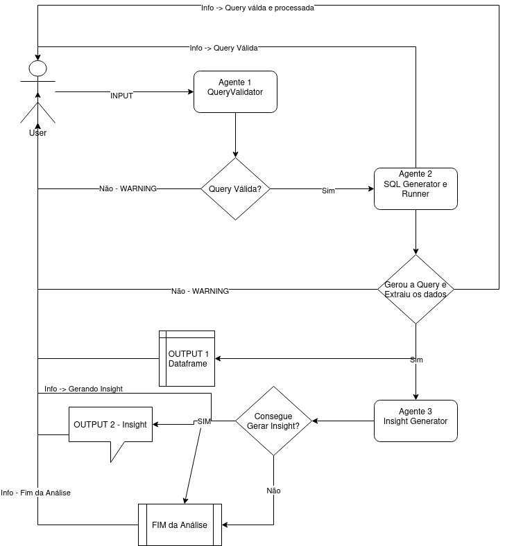

# 📄 Sobre
**Nome do autor: Tomás N. P. Barros**

**email: samotbnp@gmail.com**

Esse projeto é um chatbot criado em cima do streamlit que utiliza agentes
para ser capaz de fazer análises sobre os dados do banco de dados abaixo.

| Nome     | Tipo do Dado                 | Exemplo                             |
| -------- | ---------------------------- | ----------------------------------- |
| REF_DATE | TIMESTAMP WITH TIME ZONE     | 2017-06-01 00:00:00+00:00            |
| TARGET   | INT (0 or 1)                 | 0, 1                                |
| SEXO     | CHAR(1) or NULL              | M, F, NULL                          |
| IDADE    | FLOAT or NULL                | 34.137, 40.447, ..., NULL            |
| VAR4     | CHAR(1) or NULL              | S, NULL                             |
| ESTADO   | CHAR(2) or NULL              | PE, PB, SP, RJ, ..., NULL            |
| CLASSE   | CHAR(1) or NULL              | A, D, E, ..., NULL                   |


# 🛠 Ferramentas
- **OpenAI e Langchain:** Integração com LLMs.
- **Streamlit:** Interface do Chatbot.
- **Psycopg2 e AWS RDS:** Comunicação com Cloud.
- **Psycopg2, Pandas e DuckDB:** Processamento de Dados.

# 🚀 Funcionalidades Implementadas
| Nome                                                                | Categoria |
|---------------------------------------------------------------------|-----------|
| Entendimento e conversão de consultas em linguagem natural para SQL | Principal |
| Apresentação dos dados requisitados e insights                      | Principal |
| Agentes que usam LLMs e têm prompts robustos                        | Principal |
| Integração com Banco de Dados na Nuvem                              | Principal |
| Código limpo, legível e bem documentado                             | Principal |
| Prompts robustos para impedir erros                                 | Principal |
| Interface do Chatbot                                                | Principal |
| Respostas Naturais                                                  | Principal |
| Testes Unitários                                                    | Extra     |

# 🔄 Fluxo do Programa
  

1. O usuário entra com uma consulta em linguagem natural sobre os dados. O agente 1,
o Query Validaator, verifica se a consulta é válida. Qualquier query que não seja uma consulta 
sobre a tabela, ou sobre as colunas da tabela vai ser rejeitada.
2. O agente 2, o SQL Executor, processa a query, a transforma em uma query SQL e retorna os dados
solicitados do banco de dados que está na AWS.
3. O agente 3, o Insight Generator, processa os dados retornados e gera insights sobre eles
se conseguir. O agente só gerará insights relacionados ao que o usuário perguntou.
4. O chat para até que o usuário faça outra pergunta.


# 🎯 Desafios
- **Integração com AWS:** A integração com a AWS foi um desafio, pois eu não tinha feito algo parecido antes.
- **Acertar a interface com o Streamlit** Apesar de simples e intuitiva, eu tentei começar com uma ideia que era
complexa e fora do escopo do Streamlit.
- **Fazer os Prompts** Fazer os prompts foi um desafio, pois eu tive que refiná-los várias vezes até chegarem ao 
resultado esperado.
- **Uso do Langchain** Apesar se ser uma boa biblioteca, algumas coisas da sintaxe do Langchain ainda são confusas
para mim pela falta de prática. Em especial os parses e os templates dos inputs


# Como Rodar a aplicação
1. Crie um ambiente virtual com Python 3.12 e instale os requirementes
```python3.12 -m venv venv && source venv/bin/activate && pip install -r requirements.txt```
2. Preencha o arquivo .env com as informações do seu banco de dados na AWS e o token do OpenAI
3. Rode o arquivo main.py com o streamlit
```streamlit run main.py```